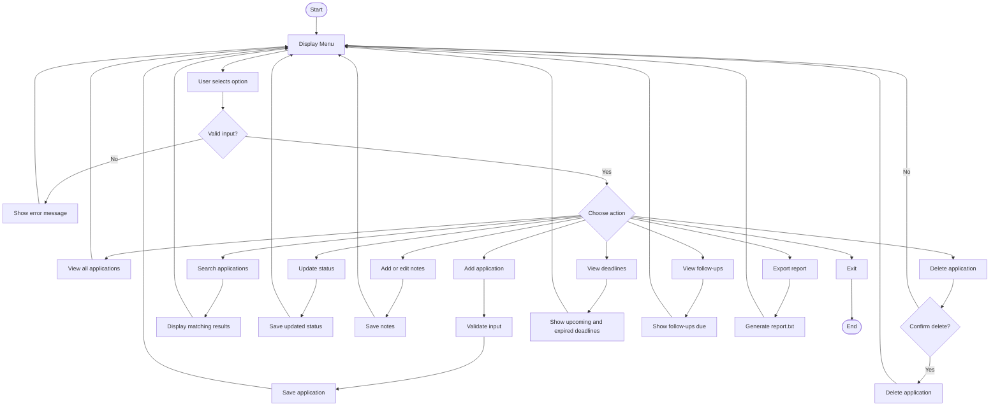
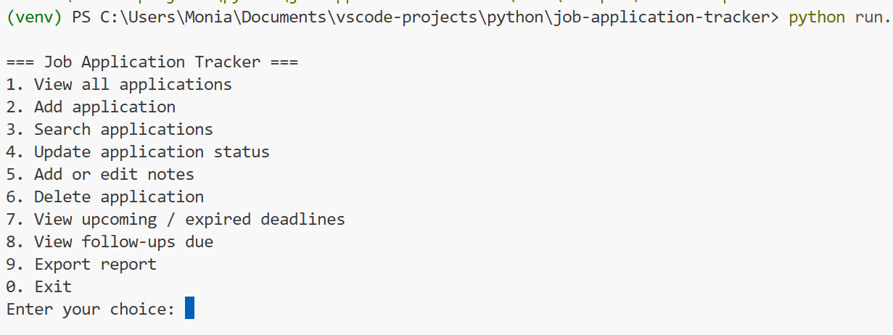
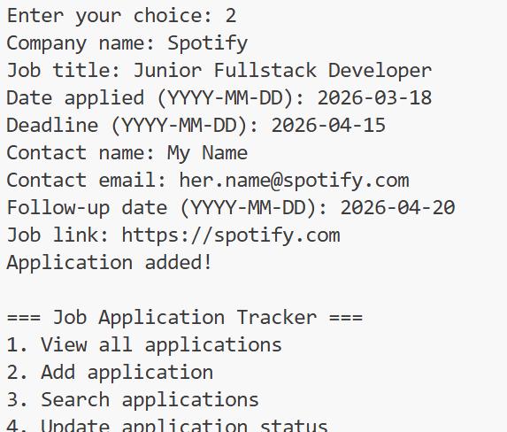
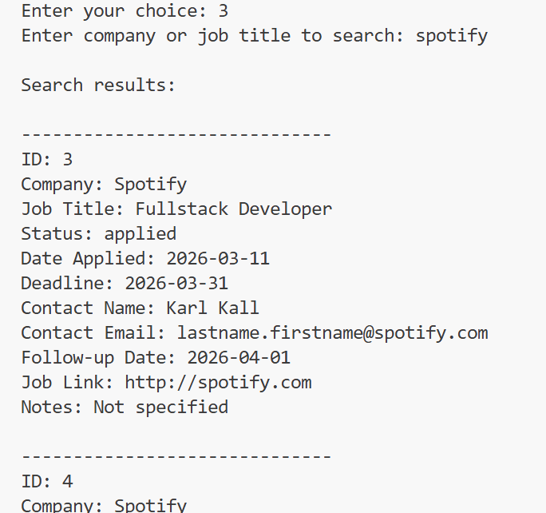
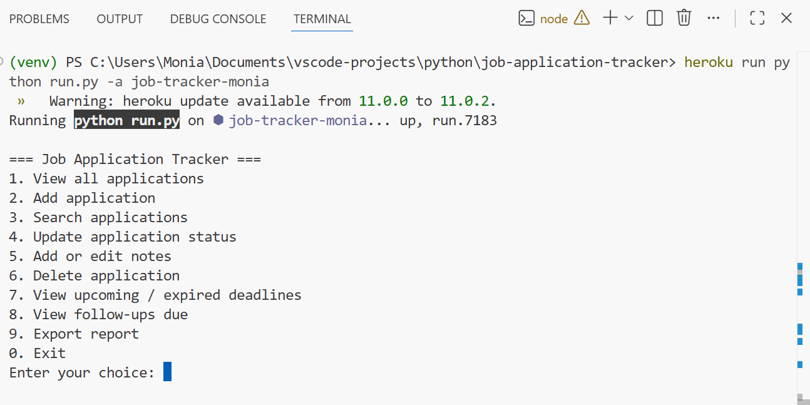
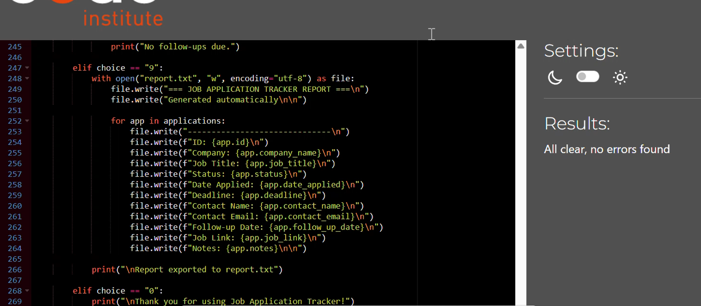

# Job Application Tracker

## Live Project

The live version of this project is deployed on Heroku and is executed as a one-off dyno via the Heroku CLI.

Because this is a pure CLI application without a web-based terminal wrapper, the application is designed to be run through the Heroku CLI rather than a browser.

To run the application:

1. Open your local terminal.
2. Log in to Heroku: `heroku login`
3. Run the following command:
   ```bash
   heroku run python run.py -a job-tracker-monia
   ```

## Introduction

Job Application Tracker is a Python command-line application designed to help users organise and manage job applications efficiently.

The project is based on a real-world need. As I am approaching the end of my studies at Code Institute, I will soon begin applying for roles within full-stack development. This will likely involve managing multiple applications at once, making it difficult to track progress, deadlines, and follow-ups manually.

This application provides a structured and practical solution by allowing users to store and manage job application data in one place through a simple command-line interface.---

## User Goals

- As a job seeker, I want to easily keep track of all my job applications in one place so I can maintain a clear overview of my progress.
- As a user, I want to be able to add, update, and remove applications so that my data always stays accurate and relevant.
- As a user, I want to search through my applications to quickly find specific roles or companies when needed.
- As a user, I want to monitor deadlines and follow-up dates so I can stay organised and not miss important opportunities.
- As a user, I want to store additional details such as notes and job links so I have all relevant information available in one system.---

## Developer Goals

- Build a structured CLI application using Python.
- Implement full CRUD functionality.
- Apply validation and defensive programming.
- Maintain clean and readable code.
- Demonstrate understanding of data modelling and deployment.---

## Rationale

The development of this application was driven by a real and immediate need.

As I approach the end of my studies at Code Institute, I will begin applying for roles within full-stack development. This process typically involves submitting multiple applications across different companies, each with its own deadlines, statuses, and follow-up requirements.

Managing this information manually can quickly become inefficient and error-prone. Important details such as application deadlines, interview dates, or follow-up reminders can easily be overlooked.

This project was designed to provide a structured and centralised way to manage that information in a clear and organised manner.

The application allows users to store, update, and retrieve job application data in one place. By implementing CRUD functionality, users can track their progress, maintain relevant notes, and ensure that important actions such as follow-ups are not missed.

A command-line interface (CLI) was chosen to focus on core programming principles such as data handling, logic flow, and validation, rather than interface design.

JSON was used as the data storage method to enable simple and readable data handling while keeping the project focused on functionality.

During development, I was aware that Heroku uses an ephemeral file system, meaning that locally stored JSON data does not persist after deployment restarts. The choice to continue with JSON was intentional to prioritise a stable and fully functional MVP.

Future improvements such as PostgreSQL or Google Sheets API can be implemented to support persistent cloud storage.---

## MS3 Design Approach

This project follows the MS3 principle of focusing on backend logic rather than visual design.

Instead of building a graphical user interface, a command-line interface (CLI) was used to:

- Emphasise program logic and data flow
- Handle user interaction through structured input and feedback
- Focus on validation, error handling, and data manipulation

This approach aligns with MS3 guidance, where the focus is on "how the logic works" rather than how the application looks.---

## Development Decisions

During the development of this project, several technical decisions were made based on the scope and goals of MS3.

A command-line interface (CLI) was chosen instead of a graphical interface to prioritise backend logic, data handling, and program structure. This aligns with the MS3 focus on how the application works rather than how it looks.

JSON was selected as the data storage solution due to its simplicity and ease of use for a single-user application. This allowed for quick implementation and clear data structure without introducing unnecessary complexity.

However, it is recognised that JSON has limitations, particularly in a deployed environment such as Heroku where the file system is ephemeral. For a more scalable solution, a database such as PostgreSQL or an external service like Google Sheets API would be more appropriate.

Input validation and error handling were prioritised to ensure the application remains stable under incorrect user input. This includes handling empty inputs, invalid formats, and incorrect menu selections.

These decisions were made to balance simplicity, functionality, and alignment with the learning objectives of the project.---

### Flowchart

The flowchart was created using Mermaid.js to ensure that the project documentation is version-controlled and easily maintainable directly within the repository.



---

## Design

This section documents the logic and flow of the application and supports planning and structure.

## Data Model

The application uses a structured data model for each job entry:

- id
- company_name
- job_title
- status
- date_applied
- deadline
- contact_name
- contact_email
- notes
- follow_up_date
- job_link---

## Technologies Used

- Python 3
- JSON
- os (file handling)
- datetime (date validation and comparison)---

## Features

- View all applications
- Add new application
- Search applications
- Update application status
- Add and edit notes
- Delete applications
- View deadlines
- View follow-ups
- Export report---

## Testing

### Manual Testing

| Feature | Input          | Expected Result  | Outcome |
| ------- | -------------- | ---------------- | ------- |
| Menu    | Invalid choice | Error message    | Pass    |
| Add     | Empty input    | Validation error | Pass    |
| Date    | Invalid date   | Error message    | Pass    |
| Search  | Not found      | Message shown    | Pass    |
| Delete  | Cancel         | No deletion      | Pass    |
| ID      | Invalid ID     | Error handled    | Pass    |

### Testing Approach

Testing was carried out manually to simulate real user interaction.

The focus was on:

- Ensuring all CRUD operations function correctly
- Validating user input and preventing invalid data
- Confirming that error messages are clear and helpful
- Verifying that the application does not crash under invalid inputs

All identified issues were resolved, and the final application runs without known logic errors.

### Edge Case Handling

The application was designed to handle a range of edge cases to ensure stability and reliability.

Examples include:

- Empty inputs are rejected and re-prompted
- Incorrect data types are handled using validation checks
- Invalid menu selections are caught and handled gracefully
- Date validation ensures logical consistency (e.g. deadlines in the past are flagged)
- Invalid IDs are handled without crashing the program

These measures ensure that the application does not break under unexpected user input.

### PEP8

Code was validated using the CI Python Linter. Minor formatting issues such as line length, indentation, and trailing whitespace were identified and corrected.---

## Application Screenshots

### App Start (Main Menu)



### Add Application



### Search Applications



### Heroku CLI Test



### PEP8 Validation



## Deployment

Deployed using Heroku.

### Deployment Steps

1. requirements.txt created using pip freeze
2. Procfile created: `worker: python run.py`
3. GitHub repository connected
4. Heroku buildpack added

### Important Note

Heroku uses an ephemeral file system, meaning data stored in JSON resets after application restarts. This limitation is acknowledged and considered in the project design.---

## Version Control

Git was used throughout development with frequent commits and clear, descriptive messages.---

## Known Bugs & Fixes

- Search not showing results
  Cause: Incorrect logic placement
  Fix: Adjusted output block

- Delete not finding ID
  Cause: ID comparison issue
  Fix: Fixed ID matching logic

- Notes not displaying
  Cause: Missing in output
  Fix: Added notes to display

- Invalid job link accepted
  Cause: Missing validation
  Fix: Added validation and retry loop

- Export showing outdated data
  Cause: Data not refreshed
  Fix: Reloaded data before export---

## Limitations

- Data resets on Heroku due to ephemeral file system
- CLI interface limits visual presentation---

## Future Improvements

- PostgreSQL integration
- Google Sheets API
- Improved CLI UI (e.g. Rich library)---

## Reflection

During development, several challenges were encountered, particularly around input validation and maintaining consistent data structure.

One key learning outcome was the importance of validating user input to prevent the application from crashing. Implementing loops and validation checks improved the robustness of the program.

If this project were to be developed further, a more scalable data storage solution such as PostgreSQL would be used to overcome the limitations of JSON, especially in a deployed environment like Heroku.

This project helped strengthen understanding of program structure, data handling, and defensive programming.---

## Credits

Code Institute
Python Documentation---

## Author

Monia

```

```
