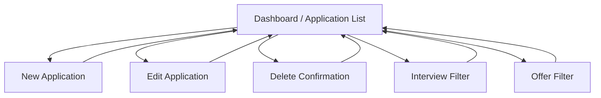
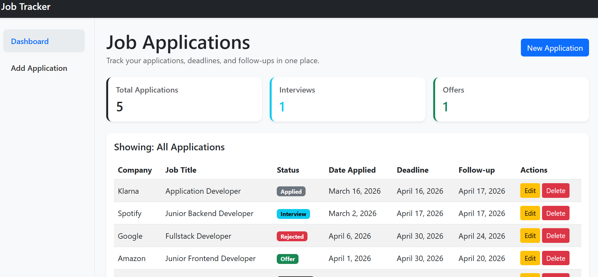
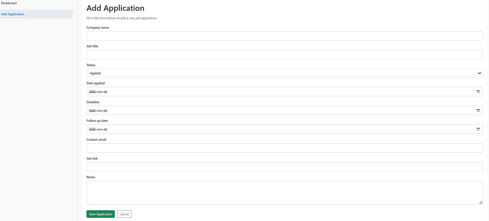
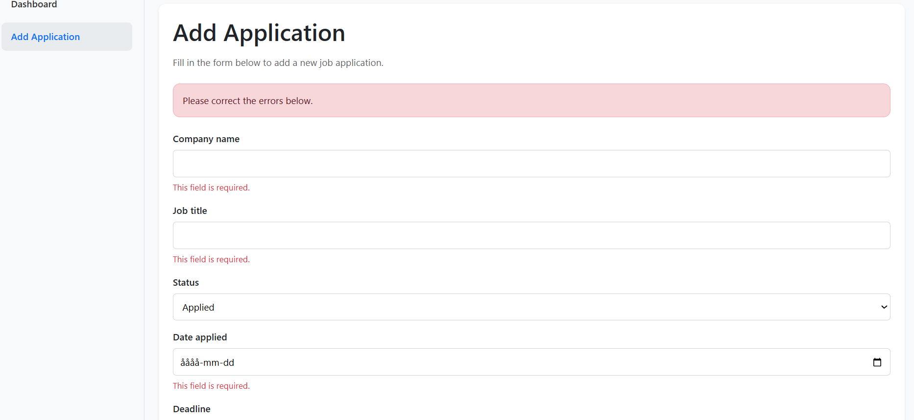
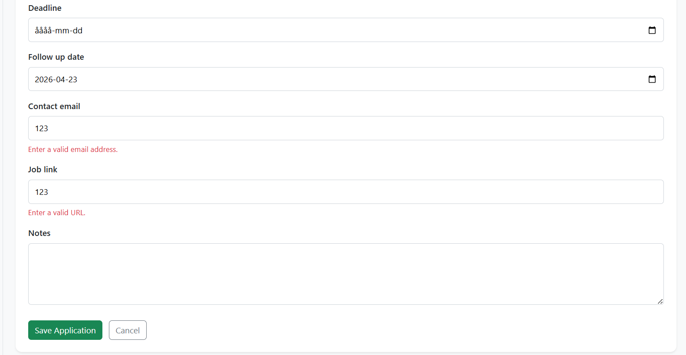
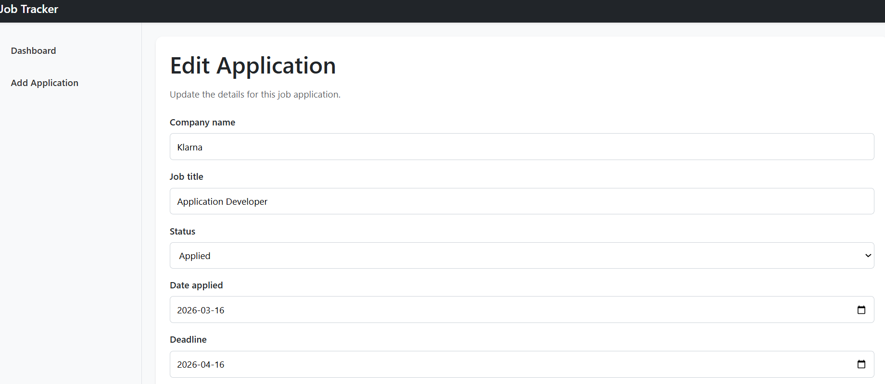
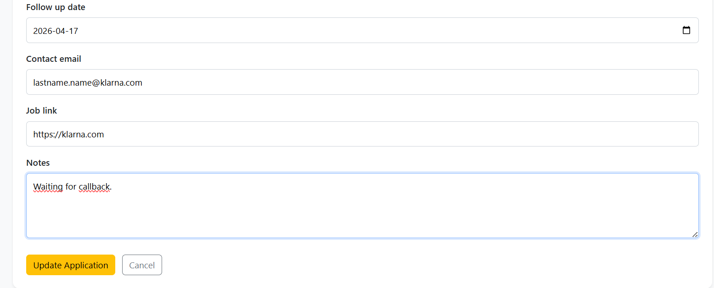
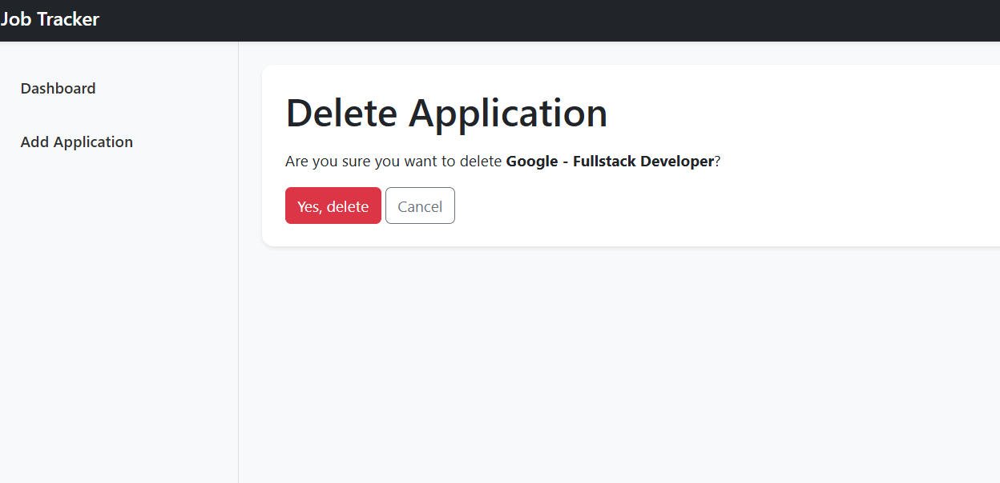

# Job Application Tracker

## Live Project

**Live App:** https://jobtracker-app-2026-dc4be7460880.herokuapp.com/

---

## Introduction

Job Application Tracker is a full-stack Django web application designed to help users organise and manage job applications in one central place.

The project is based on a real-world need. As I approach the end of my studies and begin applying for development roles, I need a reliable way to track applications, deadlines, follow-up dates, statuses and related links. Managing this manually becomes difficult when several applications are active at the same time.

This application provides a practical solution by allowing users to create, view, update and delete job application records through a clean browser-based interface. It also gives immediate feedback after user actions, validates input, and stores data in a structured relational database.

---

## Evolution of the Project

This project originally began as a Python CLI application.

The CLI version focused on backend logic and data handling, but it had important limitations:

- it was less user-friendly than a web application
- it relied on a simpler storage approach
- it was not ideal as a polished deployed product
- it did not provide the type of visual feedback and interaction expected from a modern application

Because of this, the project was developed further into a Django full-stack application.

### Why the project was rebuilt as a web application

The Django version allowed the project to become:

- easier to use
- visually structured
- database-backed in a more scalable way
- suitable for cloud deployment
- closer to a real-world production workflow

### What improved from the CLI version

Compared with the original version, the final Django version now includes:

- multi-page web interface
- reusable templates
- relational database structure
- PostgreSQL in production
- full CRUD in the browser
- dashboard statistics
- clickable dashboard cards
- inline validation errors
- Django success and error messages
- deployment-ready settings and security improvements

The Git history shows this transition clearly, from a command-line prototype to a fully deployed full-stack application.

---

## Project Rationale

The aim of the project is to solve a realistic organisational problem for job seekers.

A user may need to keep track of many applications at once, each with different:

- companies
- job titles
- statuses
- deadlines
- follow-up dates
- job links
- notes

Without a system, important details can easily be missed.

Job Application Tracker was therefore built to provide a simple but effective dashboard where users can:

- store relevant application records
- update them as the application process changes
- remove outdated applications
- monitor progress through visible statistics
- maintain a structured overview of their job search

The final application has a clear purpose that is immediately evident to a new user from the dashboard and navigation.

---

## User Goals

- As a job seeker, I want to manage all my job applications in one place.
- As a user, I want to add new applications quickly and clearly.
- As a user, I want to edit existing applications when statuses or details change.
- As a user, I want to delete old or irrelevant applications.
- As a user, I want a quick dashboard summary of my progress.
- As a user, I want immediate feedback after performing actions.
- As a user, I want clear error messages when something is entered incorrectly.

---

## Developer Goals

- Build a database-backed Django application using Python.
- Implement full CRUD functionality.
- Use a structured relational data model.
- Apply UX principles such as hierarchy, feedback, consistency and user control.
- Use responsive layout and styling.
- Deploy the project to Heroku with PostgreSQL.
- Store secret keys securely using environment variables.

---

## UX and Design

### Design Principles Applied

The application was designed around key UX principles.

#### Information hierarchy

The most important data is shown first on the dashboard through summary cards:

- Total Applications
- Interviews
- Offers

This gives users an immediate overview before they look through the full table of records.

#### Clear navigation

The layout uses:

- a top navigation bar
- a sidebar navigation menu
- a main content area

The sidebar keeps the structure simple and the active state makes it clear where the user currently is.

#### User control

Users can freely perform key actions:

- add an application
- edit an application
- delete an application
- cancel actions
- return to the dashboard

The delete flow uses a separate confirmation page so the user stays in control and cannot accidentally remove data with a single click.

#### Immediate feedback

The application provides clear and immediate feedback through Django messages.

Examples include:

- `Application added successfully.`
- `Application updated successfully.`
- `Application deleted successfully.`
- `Please correct the errors below.`
- `Enter a valid URL.`
- `Enter a valid email address.`
- `This field is required.`

This helps the user understand what just happened and what to do next.

#### Consistency

Consistency is maintained across all pages through:

- template inheritance with `base.html`
- shared navigation
- consistent cards and spacing
- consistent button colours
- consistent table styling
- consistent form structure
- consistent alert styling for success and errors

#### Accessibility and clarity

The interface includes:

- visible labels for form fields
- clear headings
- structured layout
- readable spacing
- clear action buttons
- error feedback near the relevant fields

The goal was to make the application understandable and usable without unnecessary friction.

---

## Why Bootstrap Was Used

Bootstrap was chosen to support responsiveness, consistency and efficient development.

It was useful because it:

- made responsive layout easier
- provided reliable grid and spacing utilities
- supported consistent cards, alerts, buttons and tables
- reduced time spent reinventing common UI components
- allowed more time to focus on backend functionality and UX improvements

Custom CSS was still used for application-specific styling and refinement.

---

## Wireframe / Flow Structure



This reflects the final multi-page web structure more accurately than the original CLI flow.

---

## Features

## Dashboard

The dashboard is the main page of the application and includes:

- page heading and explanatory text
- primary action button: **New Application**
- three statistics cards:
  - Total Applications
  - Interviews
  - Offers
- table view of all application records
- action buttons for Edit and Delete

### Clickable dashboard cards

The dashboard cards are interactive and filter the data displayed in the table:

- **Total Applications** shows all applications
- **Interviews** shows only interview applications
- **Offers** shows only offer applications

These cards were enhanced with:

- hover effects
- colour indicators
- clearer visual affordance so users understand they are clickable

---

## Screenshots

### Dashboard Overview



The dashboard provides an overview of all job applications, including key statistics such as total applications, interviews and offers. It also displays all records in a structured table with edit and delete actions.

---

### Add Application Form



The user can add a new job application using a structured form with clearly labelled fields, allowing efficient data entry.

---

### Validation Errors (Top)



---

### Validation Errors (Bottom)



Validation prevents incorrect data from being submitted. Required fields, invalid inputs and formatting errors are clearly highlighted, ensuring data integrity and improving user experience.

---

### Edit Application (Top)



---

### Edit Application (Bottom)



The user can update existing applications. Fields are pre-populated with existing data, allowing quick and efficient editing.

---

### Delete Confirmation



A confirmation page ensures that users do not accidentally delete records, improving usability and preventing data loss.

---

## CRUD Functionality

### Create

Users can add a new job application through a form.

### Read

Users can view all records on the main dashboard in a structured table.

### Update

Users can edit existing applications through a dedicated edit page.

### Delete

Users can remove applications through a delete confirmation page.

### Immediate reflection in the UI

All CRUD actions are immediately reflected in the interface.

**Examples:**

- added records appear in the list
- edited values update instantly in the table
- deleted records disappear from the list
- dashboard statistics recalculate from the database

This demonstrates that data actions are immediately reflected in the frontend, providing real-time feedback and improving the overall user experience.

---

## Templates

The project uses Django templates correctly and consistently.

### Main templates

- `base.html`
- `application_list.html`
- `add_application.html`
- `edit_application.html`
- `delete_application.html`

### Template usage

`base.html` provides a reusable layout containing:

- navbar
- sidebar
- message display area
- shared layout styling

The other templates extend the base template using Django template inheritance and define their own `` sections.

This improves maintainability, consistency and readability.

---

## Data Model

The application is built around one main model: `JobApplication`.

### Fields currently used in the Django application

- `company_name`
- `job_title`
- `status`
- `date_applied`
- `deadline`
- `follow_up_date`
- `contact_email`
- `job_link`
- `notes`

### Data design rationale

Each record represents one job application.

This structure was chosen because it allows the user to record the most relevant data needed to manage the application lifecycle:

- who the application is for
- what role it is for
- the application stage
- important dates
- contact information
- supporting notes and links

The structure is also suitable for future extension, such as search, user accounts, and more advanced filtering.

---

## Database Design

### Development environment

The local development version uses **SQLite**.

### Production environment

The deployed Heroku version uses **PostgreSQL**.

### Why this approach was used

This setup allows:

- simple local development
- more production-appropriate deployment
- centralised configuration in `settings.py`
- easy switching of the database backend through environment-based configuration

---

## Technologies Used

### Backend

- Python
- Django

### Frontend

- HTML
- CSS
- Bootstrap

### Database

- SQLite for local development
- PostgreSQL for deployed production

### Deployment and infrastructure

- Heroku
- Gunicorn
- WhiteNoise
- dj-database-url

---

## Validation and Error Handling

This project includes validation and defensive design at both UX and data-input level.

### Form validation used

Validation was tested and implemented for:

- required fields
- URL format
- general invalid form submission
- field-level feedback
- top-level form feedback

### Examples of validation behaviour

#### Required fields

If required fields are left empty, the user is not allowed to continue silently. The form displays:

- a top-level message:
  - `Please correct the errors below.`
- field-specific errors below the affected inputs

#### Invalid URL input

If the user enters an invalid job link, Django validation prevents the form from saving and shows a clear field-level error under the relevant field.

#### Invalid overall form state

When a form fails validation, the app does not crash or redirect unexpectedly. Instead, the user remains on the same page and receives clear feedback.

### Why this matters

This improves the robustness of the application because:

- invalid data is not saved
- the user understands what is wrong
- the interface stays stable
- input errors are handled gracefully

This approach improves the overall robustness of the application by ensuring that invalid data is prevented, errors are clearly communicated, and the user experience remains stable and predictable.

---

## User Feedback

The application provides clear feedback for both successful and unsuccessful actions.

### Success messages implemented

After successful actions, the user sees a Bootstrap success alert such as:

- `Application added successfully.`
- `Application updated successfully.`
- `Application deleted successfully.`

### Error messages implemented

When validation fails, the user sees:

- top-level message:
  - `Please correct the errors below.`
- inline field-level error messages directly beneath the field that contains invalid input such as: -`Enter a valid email address.` -`Enter a valid URL.` -`This field is required.`

### UX purpose of feedback

These messages were added to ensure that:

- the user is always informed about completed actions
- the user knows when an action failed
- the user can identify the cause of the error quickly
- the application feels responsive and trustworthy

---

## Test Data

The deployed application includes example data to demonstrate functionality immediately.

This improves the user experience by allowing first-time users to understand the application without needing to create data before interacting with it.

This enables users to:

- instantly view dashboard statistics
- understand how data is structured and displayed
- explore CRUD functionality without initial setup

The user can still:

- create new applications
- edit existing applications
- delete all applications if desired

The example data reflects realistic job applications to simulate a real-world use case.

---

## Testing

Testing was carried out manually during development and again after deployment.

The testing process focused on:

- CRUD functionality
- validation
- error handling
- user feedback
- dashboard logic
- responsiveness
- deployment consistency

## Manual Testing Table

| Area               | Test                 | Action                                  | Expected Result                          | Outcome |
| ------------------ | -------------------- | --------------------------------------- | ---------------------------------------- | ------- |
| Create             | Add valid record     | Submit form with valid data             | Record saves and appears in list         | Pass    |
| Read               | View dashboard       | Open application list page              | Existing data displays correctly         | Pass    |
| Update             | Edit record          | Change data and submit                  | Edited values appear in list             | Pass    |
| Delete             | Delete record        | Confirm deletion                        | Record is removed from list              | Pass    |
| Dashboard stats    | Dynamic totals       | Add/edit/delete records                 | Stats update automatically               | Pass    |
| Card filter        | Interview card       | Click interview card                    | Only interview records shown             | Pass    |
| Card filter        | Offer card           | Click offer card                        | Only offer records shown                 | Pass    |
| Card filter        | Total card           | Click total applications                | All records shown again                  | Pass    |
| Required fields    | Empty required input | Submit incomplete form                  | Form rejected with clear error           | Pass    |
| URL validation     | Invalid job link     | Submit incorrect URL                    | Inline error shown for field             | Pass    |
| Error message      | Invalid form         | Submit form with invalid input          | “Please correct the errors below” shown  | Pass    |
| Success message    | Valid create         | Submit valid new application            | Success alert shown                      | Pass    |
| Success message    | Valid update         | Update application                      | Success alert shown                      | Pass    |
| Success message    | Valid delete         | Delete application                      | Success alert shown                      | Pass    |
| Navigation         | Sidebar links        | Move between pages                      | No broken internal links                 | Pass    |
| Layout             | Responsive behaviour | Resize window / different device widths | Layout remains usable and readable       | Pass    |
| Deployment         | Live app check       | Open deployed Heroku app                | Live version matches development version | Pass    |
| Internal stability | User actions         | Navigate, submit, cancel, edit, delete  | No internal errors or broken flow        | Pass    |

## Validation-specific testing

### Validation tests completed

1. **Required field validation**
   - left required fields empty
   - confirmed that the form did not save
   - confirmed that the page displayed a clear validation state

2. **Invalid URL validation**
   - entered an invalid job link
   - confirmed that the record did not save
   - confirmed that the user received visible field-level feedback

3. **Error message visibility**
   - confirmed that the user sees:
     - general form error message
     - specific field-level validation message

4. **Success message visibility**
   - confirmed that create, update and delete all produce obvious feedback messages

5. **CRUD reflection**
   - confirmed that all successful changes appear immediately in the UI and dashboard totals

## Bugs found and fixed

Examples of issues encountered and resolved during development:

- **Django template syntax error**
  - Cause: An unclosed template block caused a rendering error.
  - Fix: The template structure was reviewed and the missing closing tag was added, restoring correct rendering.

- **Duplicated Procfile**
  - Cause: The Procfile was accidentally created in multiple locations, causing deployment confusion.
  - Fix: The duplicate file was removed and a single Procfile was kept in the correct root directory.

- **Dashboard cards showing static data**
  - Cause: Hardcoded values were used instead of querying the database.
  - Fix: The dashboard logic was updated to dynamically calculate values using Django ORM queries.

- **Clickable dashboard cards not visually clear**
  - Cause: No visual indication that the cards were interactive.
  - Fix: Hover effects and styling were added to improve affordance and usability.

- **Missing user feedback after CRUD actions**
  - Cause: No confirmation was shown after create, update or delete actions.
  - Fix: Django messages were implemented to provide clear success feedback.

- **Weak form usability (no inline validation)**
  - Cause: Validation errors were not clearly displayed next to fields.
  - Fix: Inline field-level error messages were added to improve usability and clarity.

- **Heroku configuration applied to wrong app**
  - Cause: CLI commands were run without specifying the correct app.
  - Fix: The correct app name was explicitly targeted using the `-a` flag.

- **Deployment and database setup issues**
  - Cause: Incorrect order of PostgreSQL setup and migrations.
  - Fix: The correct deployment sequence was followed: add database → configure settings → run migrations.

## Remaining bugs

At the time of submission, no major functional bugs remain.

---

## Security Features

The project includes key security practices appropriate to its scope.

### Secret key management

The application uses environment variables for production secrets.

The repository does not store a real production `SECRET_KEY` in committed code.

### Debug handling

`DEBUG` is configured so that production can run with debug disabled.

### Sensitive data

Sensitive values are stored in environment variables / Heroku config vars rather than being committed directly to GitHub.

---

## Deployment

The final application was deployed to Heroku.

### Deployment steps followed

1. A new Heroku application was created for the Django version.
2. Required dependencies were installed.
3. `requirements.txt` was generated and kept up to date.
4. A `Procfile` was added in the project root:

   ```text
   web: gunicorn job_application_tracker.wsgi

   ```

5. `settings.py` was updated for:
   - environment variables
   - PostgreSQL in production
   - static files with WhiteNoise

6. A Heroku PostgreSQL add-on was created.
7. `SECRET_KEY` was added as a Heroku config variable.
8. The project was pushed to Heroku.
9. Database migrations were run on Heroku.
10. The deployed application was opened and tested.

---

## Deployment checks completed

After deployment I checked that:

- the app opened successfully
- pages loaded correctly
- CRUD still worked
- validation still worked
- dashboard statistics still updated correctly
- the deployed version matched the local development version

---

## Code Quality and Readability

The project was written with attention to clean code principles.

This includes:

- descriptive file names
- consistent naming conventions
- meaningful variable and function names
- grouped file structure
- consistent indentation
- reusable templates
- separate CSS file
- Django framework conventions followed correctly

The code was developed to remain readable, maintainable and easy to follow.

---

## Version Control

Git and GitHub were used throughout the development process.

---

## Real-World Value

This application addresses a realistic need for job seekers who need a reliable way to manage multiple active applications at once.

It provides value by offering:

- a centralised application tracker
- clear progress visibility
- persistent cloud-based storage in production
- quick editing and deletion
- useful dashboard summaries
- structured job-search organisation

---

## Future Improvements

Possible future enhancements include:

- authentication and user accounts
- search functionality
- more advanced filtering
- reminders and notifications
- multi-user support
- richer analytics and reporting

---

## Reflection

This project shows my progression from building a simple Python CLI application to designing, building and deploying a full-stack Django web application.

The most important learning outcomes included:

- understanding how backend and frontend work together in Django
- building reusable templates and structured views
- designing around user feedback and UX principles
- validating input more effectively
- configuring deployment with Heroku and PostgreSQL
- improving security through environment variables

The final application is significantly stronger than the original CLI prototype. It is more user-friendly, more scalable, and much closer to the standard expected of a publishable real-world application.

---

## Credits

- Code Institute course materials and guidance:
- Heroku Documentation
- Code Institute walkthrough project
- Django Documentation
- Bootstrap

---

```

```
